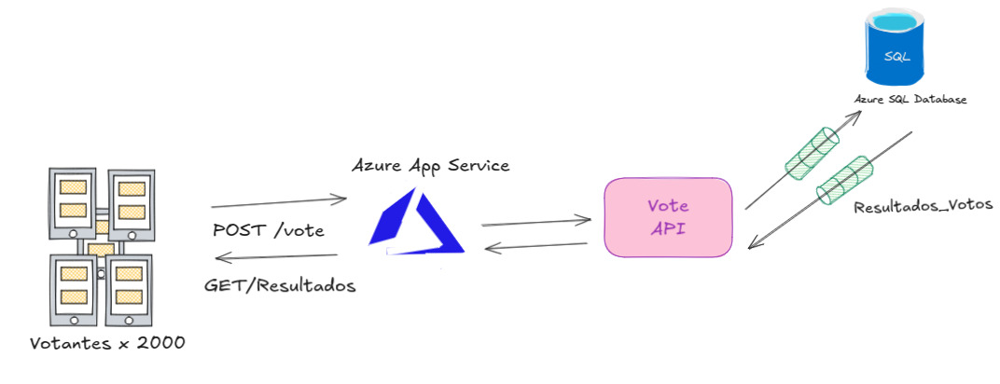

# F*cks News Poll

Real-time voting app for live comedy events. The audience votes from their phones, results update instantly on screen, and the comedians control the whole thing from their own devices.

Built for Camilo Pardo (Mago) vs Camilo Sánchez — but works for any event they run.

## How it works

Two URLs:

- **`/`** — Public link sent to the audience. Shows a waiting screen until the round starts, then two vote buttons appear. One vote per device.
- **`/admin?token=SECRET`** — Private link bookmarked on the comedians' phones. Has the start/stop/reset controls and shows live vote counts with exact numbers.

When someone on stage hits "Iniciar Batalla", every phone in the room switches from the waiting screen to voting mode in under a second. No refresh needed.

When the round ends, every screen switches to a winner reveal — animated emoji rain, glowing name, final vote counts.

## Architecture



## Stack

- **Frontend:** React + TypeScript + Vite
- **Styling:** Tailwind CSS
- **Database:** Azure SQL (T-SQL) with Real-time Triggers ($O(1)$ performance)
- **Backend:** Node.js (Express) on Azure App Service
- **Auth:** Microsoft Entra ID (Managed Identity) for DB access
- **PWA:** Optimized for mobile data during live shows

## Performance Optimization

The app is designed to handle **2,000 concurrent users** during a live show. Instead of performing expensive `COUNT(*)` operations on every load, we use a dedicated `resultados_votos` table that is updated atomically by database triggers. This reduces the initial load time to **under 200ms**.


## Admin URL

After deploying, the admin link looks like:

```
https://fknews.lat/admin?token=secret-token
```


## Vote deduplication

Each device gets a UUID stored in localStorage. That ID is sent with every vote and has a unique constraint in the database, so even if someone clears the page and tries again, the second insert fails silently and the UI shows them as already voted.

When a new round starts, the voted flag resets automatically.
